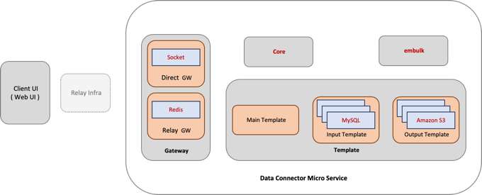

# Data Connector
  
데이터 수집 서비스  

## 폴더 / 파일 구조
  
**/apitest**  
&nbsp; &nbsp; 
gateway 테스트용 fastapi 서버 / backend example  
**/bin**  
&nbsp; &nbsp; 
emulk 실행 스크립트  
**/conf.d**  
&nbsp; &nbsp;
설정파일  
**/k8s**  
&nbsp; &nbsp;
kubernetes 인프라 구성 
( 2021.09.08 helm chart "[hancyberML-dataconnector](http://xxx.xxx.xxx.xxx:9000/hancyber-repo/helm-chart#hancyberML-dataconnector)" 로 이관 )  
**/src**  
&nbsp; &nbsp;
python source code  
**/template**  
&nbsp; &nbsp;
embulk configuration template  
**/tls**  
&nbsp; &nbsp;
redis 인증 tls  
**apitest.sh**  
&nbsp; &nbsp;
gateway 테스트용 fastapi 서버 구동 스크립트  
**Dockerfile**  
&nbsp; &nbsp;
이미지생성 dockerfile  
**entrypoint.sh**  
&nbsp; &nbsp;
이미지 entrypoint  
**requirements.txt**  
&nbsp; &nbsp;
python dependencies  

---
## **본 코드는 단순 리뷰용입니다.**    
### 코드의 일부/라이브러리는 의도적으로 누락되었거나 일부 데이터는 임의의 데이터로 교체되었습니다.